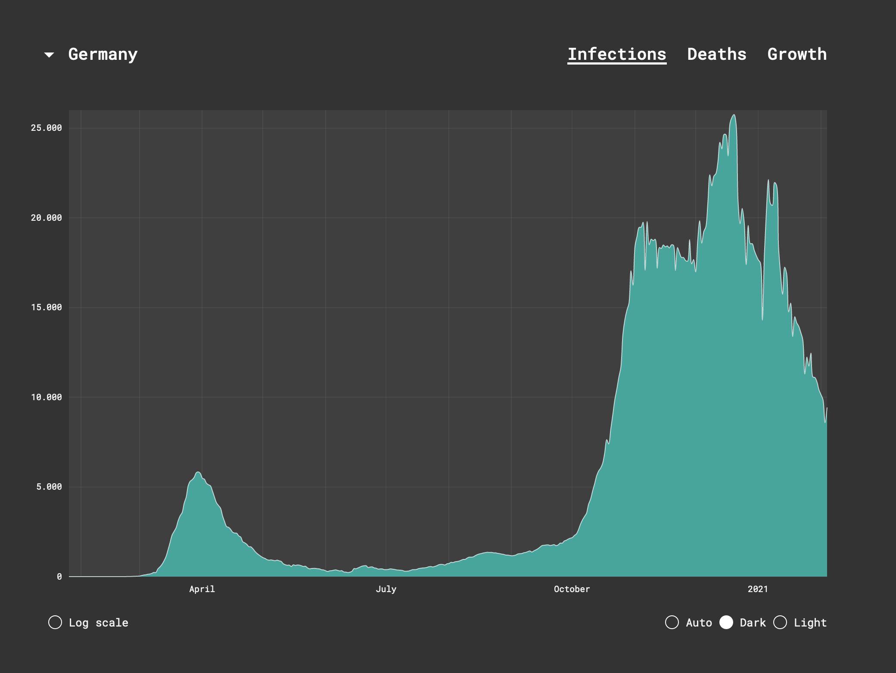

# Corona

This React app shows timeline graphs of the COVID19 infections and deaths per country.
It runs on [corona.leongeorgi.de](https://corona.leongeorgi.de). 



## Development

### Frontend
First, change the working directory.
```shell script
cd frontend/
```
#### Install dependencies
On your first run you have to install the dependencies.
```shell script
npm install
```

#### Run the server
```shell script
npm start
```

### Backend
First, change the working directory.
```shell script
cd backend/
```

#### Install dependencies
On your first run you have to install the dependencies.
##### With Pipenv
```shell script
pipenv install
```
##### Without Pipenv

```shell script
pip install -r requirements.txt
```

#### Run the server

##### With Pipenv
```shell script
pipenv run gunicorn --bind 0.0.0.0:5000 wsgi:app
```
##### Without Pipenv

```shell script
gunicorn --bind 0.0.0.0:5000 wsgi:app
```

## Deployment

```shell script
docker-compose build
docker-compose up -d
```